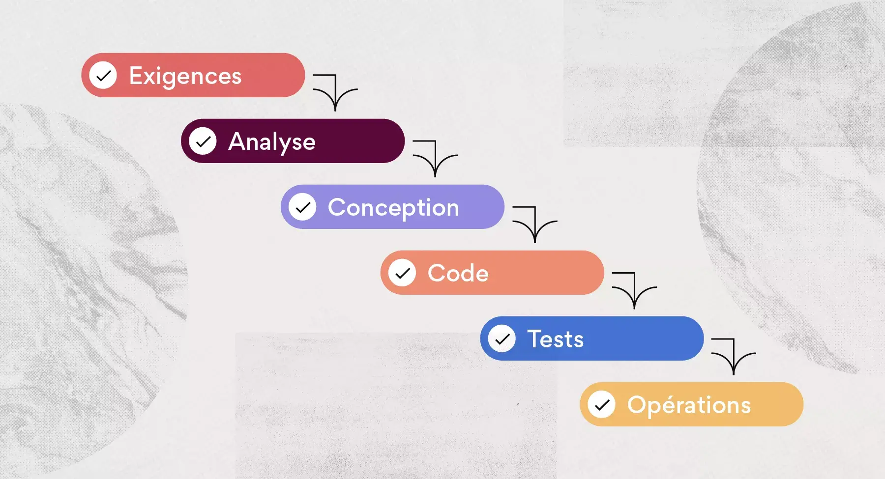
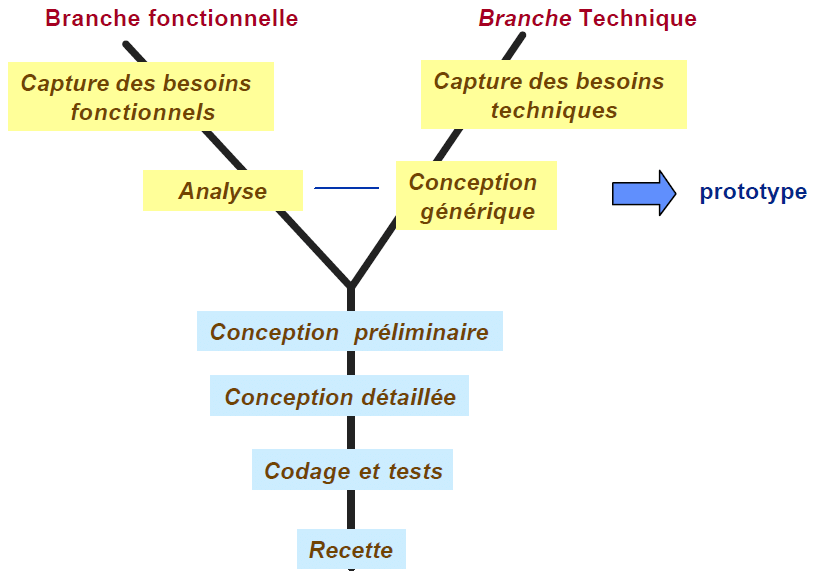
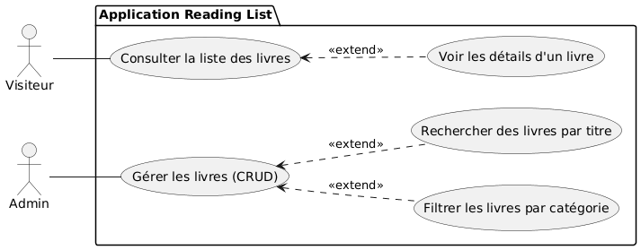
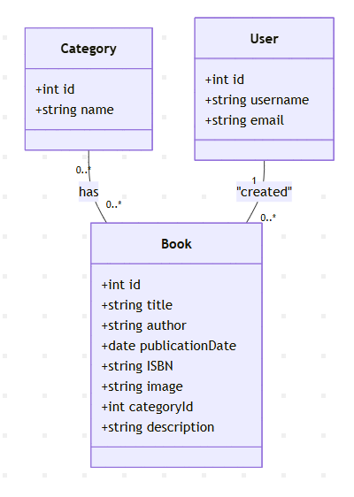

<!-- Page de garde -->
# Présentation Projet technique
### Application de gestion de liste de lecture
**Présentée par : Yasmine haddad**  
**Encadré par : M. Fouad Essarraj**  
**Date : 05/01/2026**

---

<!-- Waterfall -->
# Waterfall

---

<!-- Choix du sujet -->
# Choix du sujet
**Reading List**

---

<!-- Contexte -->
# Contexte

---

<!-- Stack Technique -->
# Stack Technique

### les technologies à utiliser
1.   **Base de données** : MYSQL
2.   **Architecture N-tier** : Services
3.   **Framework** : Laravel
4.   **Architecture** : MVC
5.   **Moteur de vues** : Blade
6.   **Ajax** 
7.   **Upload image**
8.   **laravel multilangue**
9.   **vite**

---
10.   **Preline UI Library**
11.   **Lucide Libarary**
12.   **C99 Tailwind**
---

## Fonctionnalité

---

<!-- conception -->
# Conception

---