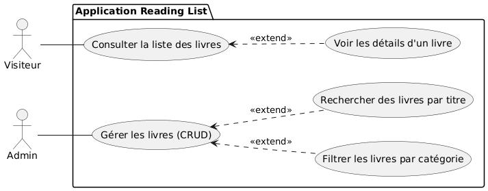
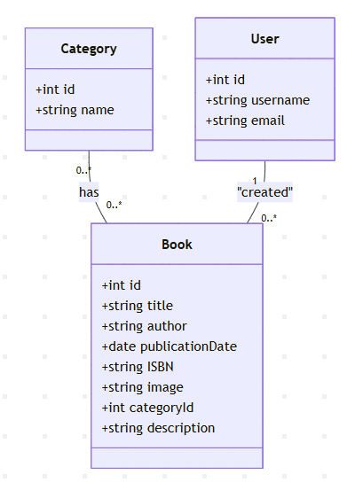

<!-- Page de garde -->
# Présentation Projet technique
### Application de gestion de liste de lecture
**Présentée par : Yasmine haddad**  
**Encadré par : M. Fouad Essarraj**  
**Date : 05/01/2026**

---
# Plan

1.  **Méthode Waterfall**
2.  **Exigences :** Travail à faire
3.  **Contexte :** Projet de Fin de Formation
4.  **Analyse Technique**
5.  **Analyse Fonctionnelle**
6.  **Conception**
7.  **Versions (v1 - v8)**

---

<!-- Waterfall -->
# Waterfall

---

<!-- Exigences -->
# Exigences: Travail à faire

### Développement d'une application de gestion de liste de lecture
*   **Partie Publique:** Interface permettant aux visiteurs de consulter les livres. Fonctionnalités : Recherche par titre, auteur, filtre par catégorie, pagination - (6 éléments/page) .
*   **Partie Admin:** Tableau de bord sécurisé pour les opérations CRUD. Fonctionnalités : Modales pour ajout/édition, AJAX pour les mises à jour asynchrones.

---

<!-- Contexte -->
# Contexte

---

<!-- Stack Technique -->
# Analyse Technique

## Les technologies à utiliser

1.  **Base de données:** MySQL.
2.  **Framework:** Laravel 12.
3.  **Architecture N-Tiers:**
    - **Controller:** Requêtes HTTP.
    - **Service:** Logique métier.
    - **Model:** Base de données.
4.  **Architecture:** MVC.
5.  **Blade:** Templates réutilisables (components, layouts).
6.  **AJAX:** Interactions dynamiques (ex: Modales) sans rechargement de page.
---  
7. **Alpine.js:** Librairie JavaScript pour les interactions dynamiques.
8. **Spatie:** Librairie pour la gestion des permissions et rôles.
9.  **Téléchargement d'images:** Possibilité de télécharger et de joindre des images aux notes.
10. **Support Multi-langue:** Support des langues française et anglaise (fr, en).
11. **Vite:** Outil de build rapide.
12. **Preline UI:** Librairie UI.
13. **Lucide:** Librairie d'icônes.
14.  **Tailwind CSS:** Développement rapide, responsive.

---

<!-- Fonctionnalité -->
# Analyse Fonctionnelle

---

<!-- conception -->
# Conception

---

# Versions

| Version | Description | Branche |
| :--- | :--- | :--- |
| **v1** | Public Side (Consultation, Recherche, Filtre) | `public` |
| **v2** | Admin Side (CRUD, Modales) | `admin` |
| **v3** | Authentification / Authorization (Gates) | `gates` |
| **v4** | SPA / AJAX | `spa-ajax` |
| **v5** | SPA / Alpine.js | `spa-alpine` |
| **v6** | Spatie / Authorization | `spatie` |
| **v7** | API | `api` |
| **v8** | Mobile App | `mobile` |

---

## **v1** : Public Side

* **Live Coding :** Création du portfolio personnel

---

## **v2** : Admin Side

* **Live Coding :** Gestion des articles (CRUD)

---

## **v3** : Authentification / Authorization

* **Live Coding :** 

---

## **v4** : SPA / AJAX

* **Live Coding :** 
  - Bouton “Ajouter” via modale
  - Barre de recherche dynamique filtrant  des éléments par Titre.

---

## **v5** : SPA / Alpine.js

* **Live Coding :** 

---

## **v6** : Spatie / Authorization

* **Live Coding :**

---

## **v7** : API

* **Live Coding :** 

---

## **v8** : Mobile App

* **Live Coding :** 